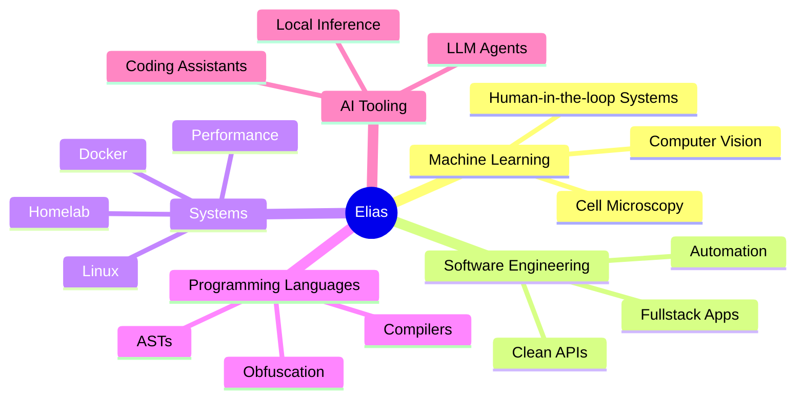

 

---

I'm **Elias**, a fullstack developer, data scientist, and computer science student at **HHU Düsseldorf**.

I like building software that sits close to the real world:  
from **machine learning systems** and **computer vision pipelines** to **developer tools** and **infrastructure**.

Currently working as a **Working Student at QIAGEN**, where I focus on data science, automation, machine learning, and practical software systems.

---

## Featured project

<table>
<tr>
<td width="100%">

<h3>
  <a href="https://github.com/prometheus-lua/Prometheus">Prometheus</a>
</h3>

  A Lua obfuscator written in pure Lua, focused on AST transformations,
  control-flow obfuscation, string encryption, anti-tamper techniques,
  and Lua-specific runtime tricks. Widely regarded

  

</td>
</tr>
</table>

---

## Tech stack

### Languages

### Frameworks & Tools

### Data & ML

---

## Interests

---

## Connect

---

